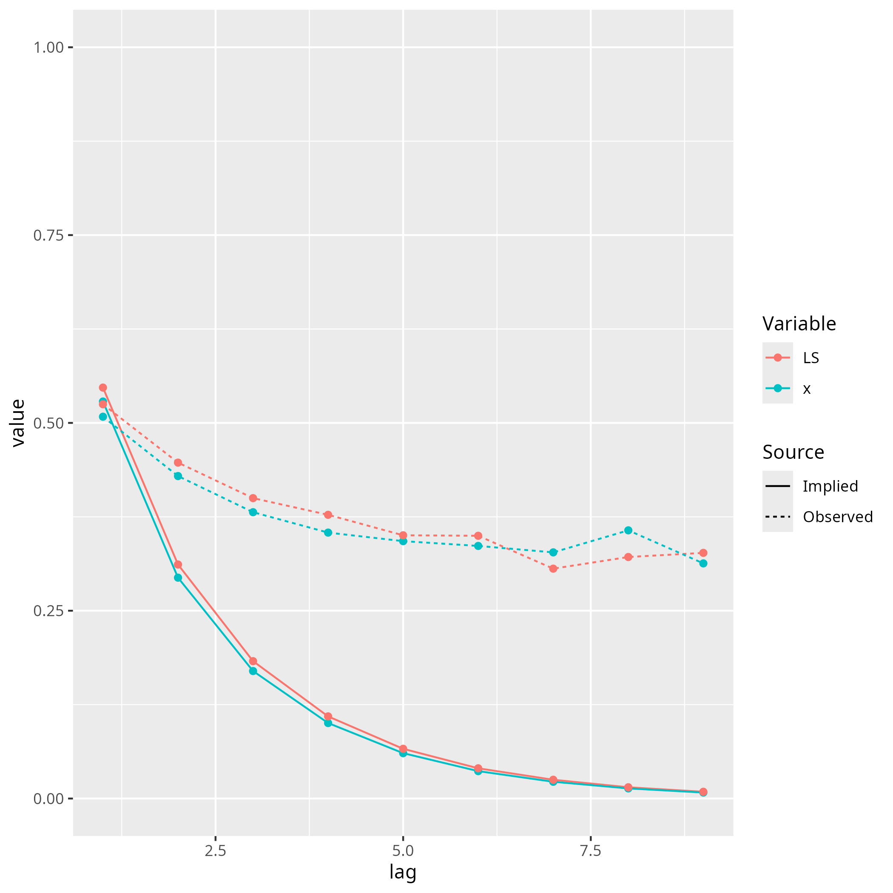
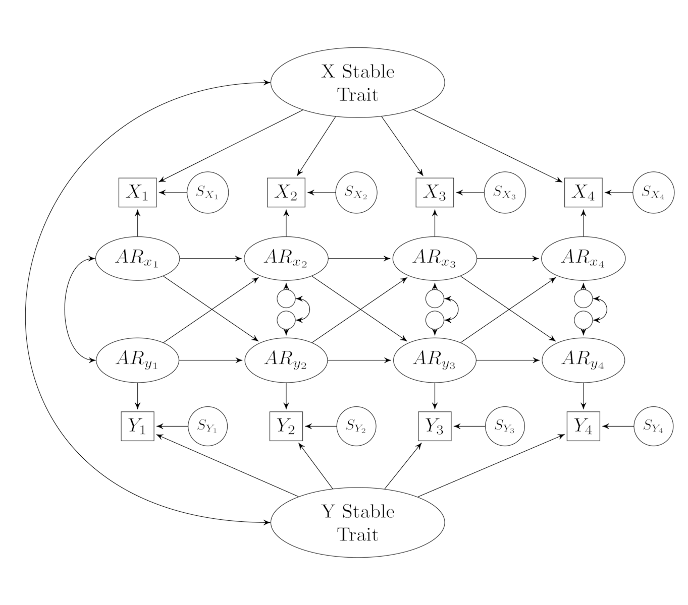
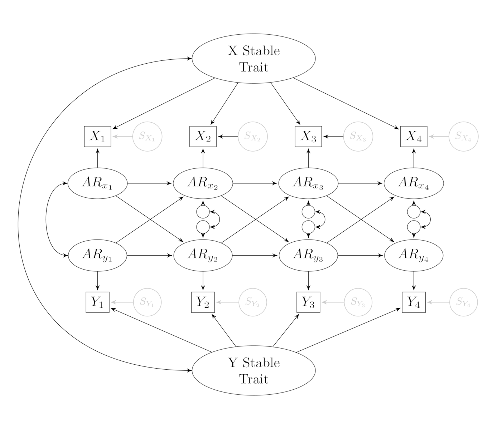
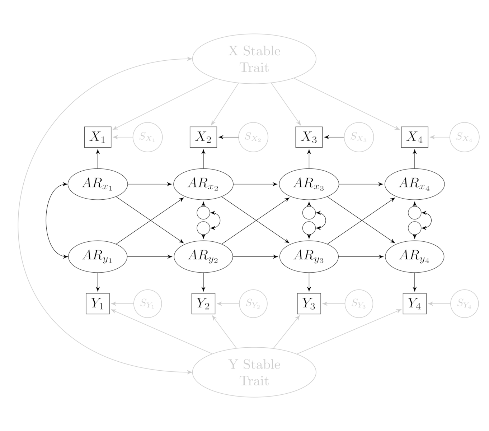
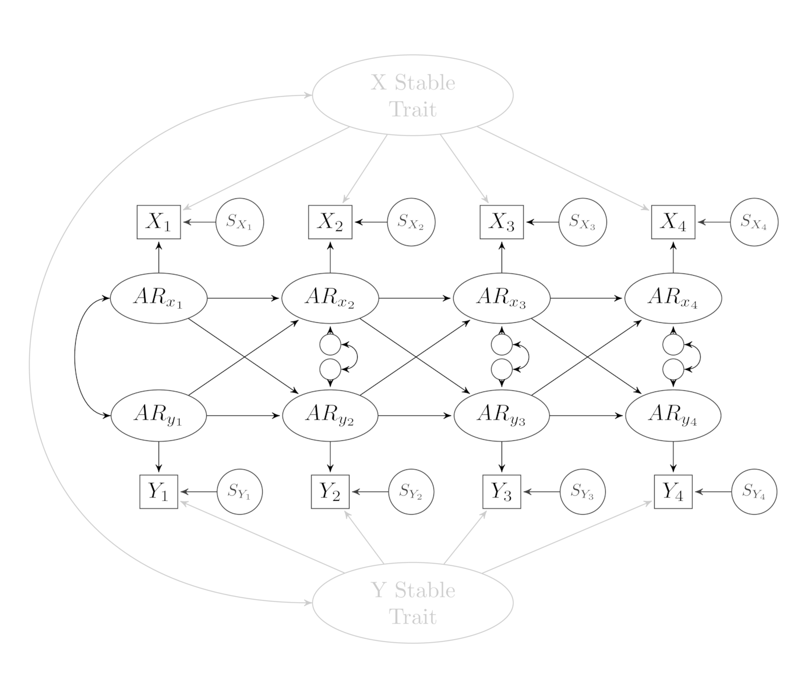
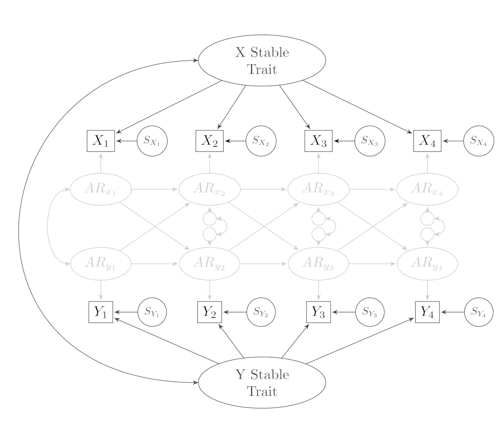
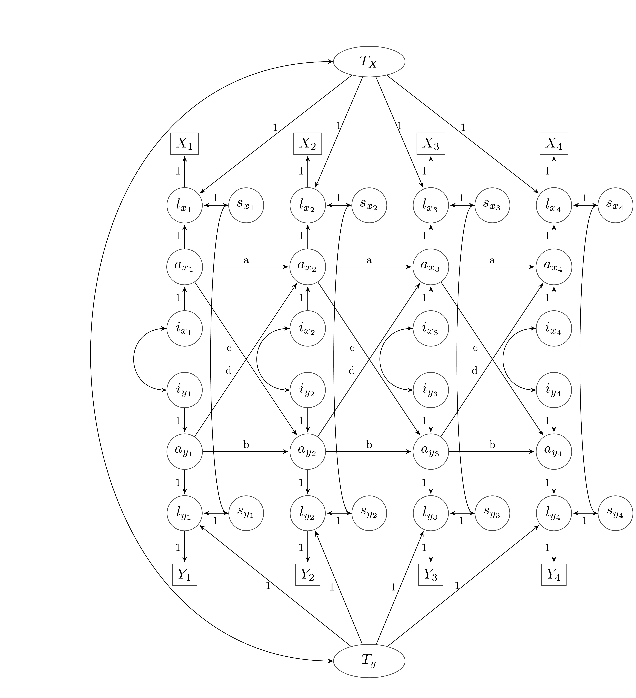
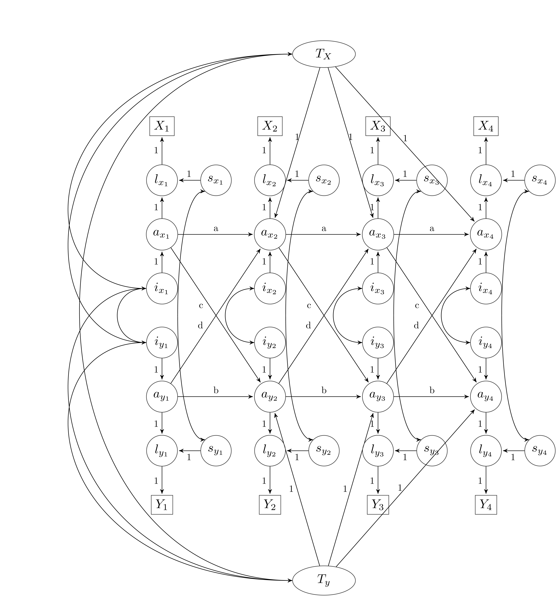

# panelCodeR Package

> [!CAUTION]
> This project is under active development. Please check the model code that this package creates before trusting the results. Please help test the code by running `panelcoder()` with data and models for which you already have results using standard approaches to writing mplus or lavaan code. Please report any issues you find.

This R package generates and runs lavaan and mplus code for models for analyzing panel data. Currently, it can test univariate and bivariate versions of the following models:

* Stable-Trait Autoregressive-Trait State (STARTS) Model, along with constrained versions including:
  - Random-Intercept Cross-Lagged Panel (RI-CLPM) Model
  - Autoregressive-Trait State (ARTS) Model
  - Stable-Trait State (STS) Model
  - Cross-Lagged Panel Model (CLPM)
* General Cross-Lagged Model (GCLM)
* Two variants of the Dynamic Panel Model (DPM; see Andersen, 2022):
  - Constrained DPM 
  - Predetermined DPM
* Latent Growth Curve Model (LGCM)
* Autoregressive Latent Trajectory Model (ALT)
* Latent Growth Model with Structured Residuals (LGM-SC)
* Simple measurement model (for data with multiple indicators per wave)

Models can include multiple indicators per wave. In addition, if stationarity is imposed, missing waves can be included by modeling phantom variables (which the package handles automatically). "State" variance (as in the state component from the STARTS model) can  also be added to models that do not have it by default (e.g., the DPM or GLCM). 

## Installation

You can install this package from from [GitHub](https://github.com/rlucas11/panelCodeR) with:
      
``` r
# install.packages("devtools")
devtools::install_github("rlucas11/panelCodeR")
```

## Using panelCodeR
### Data

One of the benefits of the package is that it flexibly creates model code based on the data you provide. In other words, the function determines how many variables (either one or two), waves, and indicators exist in your data, and then creates a model appropriate for those data. This means, however, that you must name your variables in a specific way for the code to work. In short, your variables must at least have a stem and a wave number, separated by an underscore (e.g. X_1, X_2, X_3). If you have multiple indicators, then you should add a number that indexes the indicator, again separated by an underscore (e.g., X_1_1, X_1_2, X_2_1, X_2_2). If there is a wave missing, just do not include those variables in the dataframe that is passed to the function (e.g., do not include X_3 if the variable was not assessed at Wave 3). The dataframe should not have any variables other than those to be used in the model (i.e., no ID variables).

**Note for Mplus**: Mplus restricts variable names to eight characters. Because of the requirement for wave and indicator indexes (along with separators), this means that the stem of your variable names must be very short. For instance, if you have more than nine waves, five of the eight characters are taken up by the wave and indicator indexes, which means that the stem cannot be more than 3 characters long. Keep this in mind when naming your variables. 


## Commands

The main function to build and run the code is `panelcoder()`. 

```R
panelcoder(data,
           title = "panelcoder",
           panelModel = "starts",
           predetermined = FALSE,
           program = "lavaan",
           crossLag = TRUE,
           ma = FALSE,
           clma = FALSE,
           traitCors = TRUE,
           arCors = TRUE,
           stateCors = FALSE,
           residCors = FALSE,
           residVar = FALSE,
           slope = "none",
           limits = TRUE,
           stationarity = TRUE,
           constrainState = TRUE,
           invariance = "paths",
           mplusAnalysis = NULL,
           mplusOutput = NULL,
           mplusDirectory = "mplus",
           constrainCors = TRUE,
           run = TRUE,
           ...
           )
```
Many of these options are self-explanatory. You will need to specify the dataframe to use. Without specifying anything else, that will run a STARTS model using lavaan, with all the default settings.

So, for example, to get output for a STARTS model from lavaan with all default settings, the following command could be used:

```R
modelOutput <- panelcoder(data)
```

To change which model is run, use the `panelModel` option to specify whether to run the "starts", "riclpm", "clpm", "arts", "sts", "dpm_c", "dpm_p", "gclm", "lgcm", "alt", "lgmsr" or "measurement" model. 

```R
modelOutput <- panelcoder(data, panelModel = "riclpm")
```


To change which program to use, select either "lavaan" or "mplus" for the `program` option. So, if you wanted to use mplus, the command would be:

```R
modelOutput <- panelcoder(data, program = "mplus")
```
The other options are described below (and in the R help functions).

- `predetermined` specifies whether to include correlations between the random intercept (i.e., stable trait component) in residualized models. As described by Andersen (2022), this addresses some problems with these models when certain assumptions are violated. 
- `crossLag` specifies whether the reciprocal lagged associations between the two variables in a bivariate model are included.
- `ma` specifies whether to include moving averages (introduced in the context of the GCLM, but technically possible to include in other models; see Zyphur et al, 2020).
- `clma` specifies whether to include cross-lagged moving averages (again introduced in the context of the GCLM).
- `traitCors` specifies whether to include the correlation between the stable trait components.
- `arCors` specifies whether to include correlations between AR components in the same wave (in bivariate models).
- `stateCors` specifies whether to include correlations between state components in the same wave (in bivariate models).
- `residCors` specifies whether to include correlations between the residuals from a specific indicator at a specific wave with the residuals for the same indicator at other waves. 
- `residVar` specifies whether to constraint the residuals for specific indicators to be the same across waves
- `slope` specifies how to set loadings for models that include a latent slope. Can be "none" (the default), "linear", "centered", or "basis". The "linear" option is required when using the ALT or LGM-SC models. 
  - Linear sets the first loading to 0 and increments by 1.
  - Centered finds the midpoint of the waves and centers loadings around this.
  - Basis sets the first wave to 0 and the last wave to 1 and then freely estimates the loading for all other waves.
- `limits` specifies whether to restrict variances to be greater than zero and correlations to be between -1 and 1. This is sometimes needed to prevent inadmissible solutions when a variance component is very small or zero. This is not currently implemented perfectly, but will be fixed in a future version. There may also be a bug that emerges only when using Mplus and constraining state variance to be equal (I am investigating). 
- `stationarity` specifies whether to impose stationarity. This can be set to "paths" (the default), "full", or "none". In the STARTS and derivatives, full stationarity can be achieved by setting autoregressive paths, cross-lagged paths, and variance of the autoregressive processes to be equal across waves. The "full" setting does this. If set to "paths" only the autoregressive paths and cross-lagged paths are set to be equal across waves. 
- `constrainState` specifies whether to constrain state variances to be equal across waves. This is required for stationarity, and may also be required in the STARTS model when full stationarity is not imposed. 
- `mplusAnalysis` specifies the ANALYSIS command to use for mplus if different from the default.
- `mplusOutput` specifies the OUTPUT command to use for mplus if different from the default.
- `mplusDirectory` specifies the directory to store .inp and .out files from mplus. This needs to be created before running the model or the command will fail with a 'file not found' error. 
- `constrainCors` specifies whether to constrain correlations between residuals with equal lags to be equal (e.g., the correlation between X_1_1 and X_2_1 would be constrained to be equal to the correlation between X_2_1 and X_3_1. 
- `run` specifies whether to run the model or just to create and print the model code. 

When you call the function, it will present a summary of some of the most important results from the model, but it is best to save the output of the command to an object (e.g., `pcOutput <- panelcoder(data)`. This object includes some information used when constructing the model, along with the lavaan or mplus code, the lavaan or mplus output, and information to plot correlations. The following functions help examine this information (these are not yet implemented, but will be soon).

The function `panelPlot()` will plot the implied and actual stabilities for increasingly long lags (up to the number of waves in the data). This can show whether the selected model accurately reproduces the actual stability coefficients from the data. Models like the CLPM often underestimate the long-term stability of the variables. If the models include only one indicator per wave, then `panelPlot()` can be used on the output from a single `panelcoder()` command. If there are multiple indicators, then it is necessary to also estimate a measurement model and then pass both the results for the focal model and the measurement model to the `panelPlot()` command.

```R
clpm <- panelcoder(data, panelModel = "clpm")
measurement <- panelcoder(data, panelModel = "measurement")
panelPlot(clpm, measurement)
```



The function `modelCode()` will produce a formatted version of the mplus or lavaan code representing the model. This could be used to check that the model was specified correctly, and it can also be copied, pasted, and modified to run models that can't be specified with panelCodeR. 

The function `modelEstimates()` will extract and print the lavaan or mplus estimates. The actual lavaan or mplus object that is created from running the model is stored in the panelCodeR output; you can access it by selecting the fourth element of the panelCodeR output (e.g., `pcOutput[[4]]`). 


## Models

### STARTS: Full and Reduced Models

Currently, `panelCodeR` can generate code for the univariate and bivariate STARTS model and a number of models nested under this more general model. The diagram below shows the STARTS model and its components, which include a stable-trait (ST) component, an autoregressive trait (ART) component, and a state (S) component for each variable. 



Reduced form models can be specified by setting certain variance components equal to zero (see Usami et al., 2019). For instance, omitting the state variance at each wave from the general model results in the Random-Intercept Cross-Lagged Panel Model (RI-CLPM), and removing both the state and stable-trait variance results in the Cross-Lagged Panel Model (CLPM). 


RI-CLPM | CLPM
:-----:|:-----:
 | 

Although the CLPM and RI-CLPM are the more commonly used reduced-form versions of the general STARTS model, it is also possible to remove just the stable-trait component, which results in an "Autoregressive-Trait State" (ARTS) model (otherwise known as the factor CLPM). Removing the autoregressive-trait component results in a simple correlated Stable-Trait model (STS). 

ARTS | STS
:-----:|:-----:
 | 


### Dynamic Panel Model

The `panelcoder()` command can also create and run lavaan or mplus code for a Dynamic Panel Model (DPM; see Dishop & Deshon, 2021). The DPM is similar to the RI-CLPM, but the autoregressive process is not attached to residualized variables (see Murayama & Gfrörer, 2023). Andersen (2022) noted that the RI-CLPM is nested within a 'constrained' version of the DPM. There are two versions of the DPM that can be fit, a 'constrained' version that uses formulas from Andersen (2022) to set the paths from the individual factor to the first waves of the X and Y variables, and a 'predetermined' version that is specified in Dishop & Deshon (2021). In this version, the individual factor is allowed to correlate with each first-wave variable. Use option `panelModel = "dpm_c"` to specify the constrained DPM and `panelModel = "dpm_p"` for the predetermined version.

### General Cross-Lagged Model

The `panelcoder()` command can also create and run lavaan or mplus code for the general cross-lagged panel model (GCLM; see Zyphur et al., 2020). The GCLM is similar to the DPM with slight variations. Specifically, in the default version, the loadings of each wave on the individual factor are allowed to vary. The GCM can also incorporate moving averages and cross-lagged moving averages. Use option `panelModel = "gclm"` and the `ma` and `clma` (logical values) options to specify this model. 

### Latent Growth Curve Model

This package can also create and run code for latent growth curve models. To specify this model, use option "lgcm" for `panelModel`. There is also an option for how to specify the slope, which can be "linear" (loadings for the slope start at 0 and increase by 1 for each wave), "centered" (where the 0 point of loadings is the midpoint of all waves and they decrease or increase by 1 as waves move away from this midpoint) or "basis" (where the first wave is set to 0 and the last wave is set to 1, but all intermediate waves are freely estimated). 

### Autoregressive Latent Trajectory Model

The ALT model is equivalent to the predetermined DPM with a linear slope. 

### Latent Growth Model with Structured Residuals

The LGM-SC model is equivalent to the RI-CLPM with a linear slope. 

### Measurement Model

If there are multiple indicators for one or both variables, it is possible to test a measurement model where each indicator loads on to its corresponding wave-specific latent trait and all wave-specific latent traits are allowed to correlate with one another. 

## Options and Features

A number of additional options and features are also available. First, code has different options for constraining parameter estimates across waves. For instance, with the STARTS and variance, it is possible to impose stationarity, where the variances, stabilities, and cross-lagged paths are set to be equal across waves; but this constraint can often be removed (stationarity options refer to the autoregressive process; state variances are set to be equal with a different option). It is also possible to remove the lagged paths. Correlations between the components for the two variables in bivariate models can also be included or excluded. 

The package handles data with multiple indicators per wave (as long as the same indicators are available at each wave). In addition, most models can be run even if some waves are missing. This is accomplished through the use of phantom variables for missing waves, but stationarity constraints must be included for these to work. 

Finally, there are a few helper functions. The package includes a function called `gen_starts()` that generates data from a STARTS model with user specified parameters (e.g., different amounts of variance for each component or different lagged paths). This can be useful for seeing how the models behave under different data-generating processes. There is a related function called `addIndicators()` that can take the data from `gen_starts()` and make multiple indicators for each wave. Finally, the function `parcel()` takes multiple-item scales and creates parcels based on the average loadings across waves. 

There are three functions that are useful after you have run a model. `panelPlot()` will plot the implied stabilities and actual stabilities for increasingly long waves (up to the length of the study). This can be useful for visualizing the ways that the model might not describe the underlying data well. Currently, this only works for manifest-variable models (i.e, not for models with multiple indicators per wave) and only for variations on the STARTS models (i.e., not for the DPM or GCLM). The function `panelEstimates()` prints all estimates from the model. The function `modelCode()` prints a formatted version of lavaan or mplus code used to run the model. This can be useful for checking that everything was specified correctly or for modifying the basic code for variations that the package cannot handle. Note that the way that panelCodeR specifies code might be a little different than if you were writing the code from scratch. For instance, because of the way the code building is automated, it avoids some of the shortcuts that can be used to write lavaan or mplus code more efficiently. 

### Comparing Models

> [!NOTE]
> This only works for Mplus output.

There is also one more function that can be used to compare a set of nested models for one variable (this is only available for Mplus right now; the function assumes that all variables are labelled "xw", where w is the wave number). The function `compareUnivariate` takes three arguments: `data` (the data file) `waves` (the number of waves), and `xWaves` (which waves actually exist). It then runs the univariate STARTS, ARTS, START, STS, and ART models. The univariate ART model corresponds to the bivariate CLPM; the univariate START model corresponds to the bivariate RI-CLPM model; the univariate ARTS model corresponds to the bivariate ARTS or factor CLPM model, and the univariate STARTS model corresponds to the bivariate STARTS model. The STS model is rarely used in a bivariate context, but it could be. 

## Modifying Model Code

Each time the `panelcoder` command is run, it first creates a lavaan parameter table specifying all of the parameters in the model. This table, in combination with other functions that specify the necessary model constraints, is then used to create lavaan or mplus model code. This model code is saved each time the model is run, both in the output from the command and for mplus in the form of the .inp file that mplus runs. This model code can be generated and modified to create additional models that panelcoder can't run directly. To make such modifications, however, it is helpful to understand how panelcoder specifies the models, as they are not created in what would be the most straightforward and efficient way when writing the code explicitly for lavaan or mplus. Instead, the functions generate code in a way that makes automating code generation and changing options a bit easier. The diagram below shows the components that are created when the `panelcoder()` command is called. 





This diagram (and the underlying model code) includes components that may not be explicitly included when writing the model code directly in lavaan or mplus. For instance, in most descriptions of the RI-CLPM, each observed variable (the *Xs* and Ys in the figure) load directly on the random-intercept and the autoregressive process is linked to the residuals at each wave. The `panelcoder()` function, on the other hand, includes a latent *l* variable for each wave, and the corresponding observed variable is an indicator of that latent variable, with a loading of 1, and there is no additional residual variance for *X<sub>T</sub>*. Although, these two approaches to specifying the model are equivalent, this feature does a few things. First, it allows for easier generalization to multiple-indicator models (where *l<sub>T</sub>* is the shared variance among a set of indicators at a single wave). Second, it makes it easier to handle missing waves with phantom variables. Third, it can be helpful to explicitly include and label each component of the model rather than having lavaan or mplus estimate implicit residual variances. Thus, for all endogenous variables, residual variances are constrained to 0. 

Similarly, for the autoregressive process, rather than estimating the variance for the initial wave of this autoregressive process and residual variances for each subsequent wave, `panelcoder()` creates latent *a* variables with no residual variance, and all estimated variances are captured by the *i* variables. This makes it easier to add *moving average* and *cross-lagged moving averagese* as described by Zyphur et al. (2020). Specifically, moving averages are estimated by including a path from *ix1* to *ax2*, and cross-lagged moving averages are estimated by including a path from *ix1* to *ay2*. 

Because of these and other features, it is important to be careful about defaults set by lavaan and mplus when running commands from those packages on modified code. For instance, `panelcoder()` assumes the use of the `lavaan()` command rather than the `sem()` command, and the use of the "nocovariances" option in the model statement of mplus. 

If you understand these features of the model code, then it should be possible to edit code created by `panelcoder()` to go beyond what the package can do. Remember, it is possible to have the package create code without running it by setting `run == FALSE` when running the `panelcoder()` command. 

Note that when running models like the DPM (sometimes called "observation-level models"), the paths from the individual factors (i.e. random intercepts, or stable-trait factors) go directly to the autoregressive process (the *a* variables) rather than the *l* variables, as in "residualized" models like the STARTS and its derivatives. 




## Utilities

I've included a few utilities that can help you better understand these models. The function `gen_starts()` can generate data based on the STARTS model. As with the functions to test these models, the function to generate data can include or exclude different variance components. See the documentation for details. There is also a function called `addIndicators()` that (as the name suggests) takes the data generated above and adds indicators so you can test the latent-variable models. 

## Issues?

Feel free to create an "Issue" to document any problems and I'll try to get to it.

## References

Andersen, H. K. (2022). Equivalent approaches to dealing with unobserved heterogeneity in cross-lagged panel models? investigating the benefits and drawbacks of the latent curve model with structured residuals and the random intercept cross-lagged panel model. *Psychological Methods, 27(5)*, 730–751. https://doi.org/10.1037/met0000285

Dishop, C. R., & DeShon, R. P. (2021). A tutorial on bollen and brand’s approach to modeling dynamics while attending to dynamic panel bias. *Psychological Methods*. [https://doi.org/10.1037/met0000333](https://doi.org/10.1037/met0000333)

Murayama, K., & Gfrörer Thomas. (2022). Thinking clearly about time-invariant confounders in cross-lagged panel models: A guide for model choice from causal inference perspective. PsyArXiv. [https://doi.org/10.31234/osf.io/bt9xr](https://doi.org/10.31234/osf.io/bt9xr)

Usami, S., Murayama, K., & Hamaker, E. L. (2019). A unified framework of longitudinal models to examine reciprocal relations. *Psychological Methods*, 24(5), 637–657. [https://doi.org/10/gf4fqx]
(https://doi.org/10/gf4fqx)
