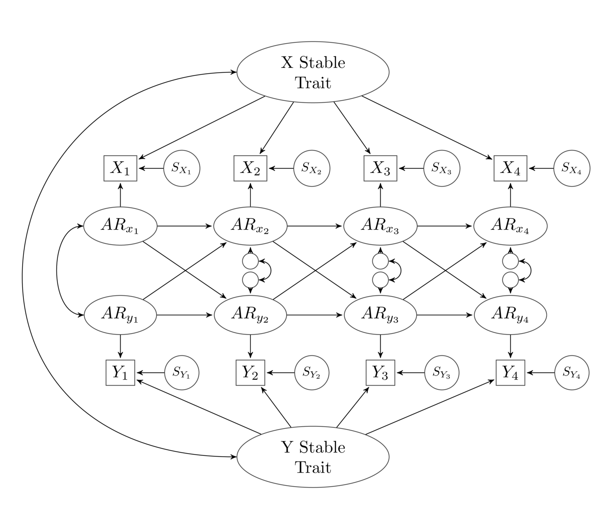

# panelCodeR Package

This R package generates lavaan and mplus code for models for analyzing panel data. Currently, it can generate code for the bivariate STARTS model and a number of models nested under this more general model. Specifically, it is possible to set different variance components to zero, which results in a reduced model. For instance, omitting the state variance at each wave results in the RI-CLPM and removing both the state and stable-trait variance results in the CLPM. It is also possible to remove the lagged paths. There are also some wrapper functions that create code for these models using appropriate options (see below).



> [!CAUTION]
> This package is under development and changes frequently. **You should check the model code that is generated to make sure it is what you want!**

## Updates!

12/29/2023: Wrote new functions and summary method for lavaan code. Now you can use `run_starts_lavaan()` and related wrapper functions to build and run code for lavaan. Also prints nice summary of most important results. 

12/27/2023: Implemented latent occasion variables with multiple indicators for lavaan. I also added some utilities for testing these models. The function `gen_starts()` generates data based on the STARTS model and `addIndicators()` can take that generated data and add indicators for each variable at each wave. 

12/24/2023: The code to compare univariate models in Mplus has been added to the package.

12/22/2023: The code to run the DPM model in Mplus has been added to the package. 

12/20/2023: I turned this into an R package. In doing this, I made a few naming changes, mostly to the lavaan functions. 

11/15/2023: I added code to generate Mplus data for a dynamic panel model. This code is in buildMplusDpm.R and it has very similar options as basic code described below. 

Also note that if there is something that the Mplus code does that you want to do in Mplus, I have been testing the `mplus2lavaan.modelSyntax()` command from the `lavaan` package, and it seems to work pretty well. The one problem is that it doesn't seem to handle phantom variables correctly. 

11/15/2023: I updated the code to allow for multiple indicators at each wave (only for Mplus). This is specified through two new arguments to the mplus functions: `xIndicators` and `yIndicators`. The default for these is `1`. If you set these to something greater than 1, the model will specify multiple indicators. You will need to make sure these are labeled with letters from 'a' to the letter corresponding to the maximum number of indicators (e.g., 'c' for 3 indicators). In other words, if you had three indicators, you need to have variables in your file labeled "x1a," "x1b," and "x1c" for Wave 1. I also added correlations between the same indicator at different wave, and by these are constrained so that correlations across equally long lags are equal (e.g., x1a with x2a is the same as x3a with x4a). Set the 'constrainCor' argument to FALSE to allow these to vary freely. 

## Installation

You can install this package from from [GitHub](https://github.com/rlucas11/panelCodeR) with:
      
``` r
# install.packages("devtools")
devtools::install_github("rlucas11/panelCodeR")
```

## Data

The code that this generates is like any other lavaan or mplus model. However, it assumes that you have two sets of variables, named x1 through xw and y1 through yw, where 'w' is the number of waves. It is possible to have missing waves, in which case, the code generator creates phantom variables for missing waves. This is often only possible if stationarity is imposed. To specify that waves are missing, use `xWaves` and/or `yWaves` to indicate which waves exist (e.g., `xWaves = c(1:5, 7:10)`). If you have multiple indicators per wave, indicators should be labeled using letters starting from 'a' (e.g., "x1a", "x1b", and "x1c" for three indicators of the variable at Wave 1). 

## Commands

For both Lavaan and Mplus, there are functions just to build the model code or to build and run the code. It is often easiest to do the latter, but the former functions are especially useful if you want to build and then modify code. 

## Lavaan Commands

The basic (and most flexible) command to build the model is `buildLavaan()`. It has the following options and defaults:

```r
buildLavaan(waves,              # Number of total waves (e.g., 10)
           XVar = TRUE,         # Include X variables
           YVar = TRUE,         # Include Y variables
           xWaves = NULL,       # The actual waves for X (leave blank if no missing waves)
           yWaves = NULL,       # The actual waves for Y (leave blank if no missing waves)
           xIndicators = 1,     # How many indicators for X?
           yIndicators = 1,     # How many indicators for Y?
           stationarity = TRUE, # Stability, cross-lagged paths, and variances constrainted across waves)
           trait = TRUE,        # Include trait component
           AR = TRUE,           # Include AR component
           state = FALSE,       # Include state component
           crossLag = TRUE,     # Include cross-lagged paths
           stateCor = FALSE,    # Include correlation between wave-specific state components
           constrainCors = TRUE,# Constrain cross-wave indicators-specific cors to be equal
           limits = TRUE        # Limits variances > 0 and correlations < 1  
           )
```

Hopefully these options are pretty self-explanatory. If you only want a univariate model and your variables are named x1 through xw, you would set `YVar = FALSE`. If you wanted to exclude lagged directional paths, you could set `crossLag = FALSE` and maybe set `stateCor = TRUE` to allow for within wave correlations. If you set `AR = FALSE` you can specify a latent-trait model with no autocorrelations across waves. 

There are also some wrapper functions that pre-specify these options to create code for different models. These are: 
- `lavaanStartsX()` and `lavaanStartsY()`, which create code for univariate STARTS models (for variables named 'x' and 'y' respectively, in case you want to test univariate models for your two variables before testing bivariate models)
- `lavaanStarts2`, which creates code for bivariate STARTS models.
- `lavaanRiclpm`, which creates code for the RI-CLPM (i.e., it sets the state variance from the STARTS to 0).
- `lavaanClpm`, which creates code for the CLPM. 
- `lavaanArts`, which creates code for the bivariate ARTS model (i.e., CLPM with state component). 

For each of these, the default is to set `stationarity = TRUE` which constrains the parameter estimates for the stabilities, cross-lagged paths, variances, and covariances to be equal across waves. This can be changed by setting `stationarity = FALSE`. For some models, this may lead to identification problems. If you have missing waves, you will need to assume (and impose) stationarity.

### Running the models

The code generates the lavaan model code, but you still have to run the model. There are two options: Using the wrapper functions to run the code or generating the code using this script, saving it to a model object, checking the code, and then running it. Because the lavaan `sem()` command has some defaults that don't work with these models (e.g., allowing all latent variables to correlate), you should usually use the `lavaan()` command instead (or specify options when running the command). So you might use the following code:

```r
startsModel <- lavaanStarts2(10) ## Generate the lavaan model
cat(startsModel) ## Check the model code
startsFit <- lavaan(startsModel, data) ## Run lavaan on the model
summary(startsFit) ## Check your results!
```

### Commands to run the models

The basic command to simultaneously build and run Lavaan code is `run_starts_lavaan()`. It has the same options as `buildLavaan()`, but with two additional options: One to specify the dataframe to use and one to pass any additional options on to the `lavaan()` command (such as different estimators or specifying how to handle missing data). So the syntax for `run_starts_lavaan()` is:

```r
run_starts_lavaan <- function(data,
                              waves,
                              XVar = TRUE,
                              YVar = TRUE,
                              xWaves = NULL,
                              yWaves = NULL,
                              xIndicators = 1,
                              yIndicators = 1,
                              trait = TRUE,
                              AR = TRUE,
                              state = TRUE,
                              crossLag = TRUE,
                              stateCor = FALSE,
                              stationarity = TRUE,
                              constrainCors = TRUE,
                              limits = TRUE,
                              ...)

```

The wrapper functions available are:

- `run_startsXlavaan()`
- `run_startsYlavaan()`
- `run_riclpm_lavaan()`
- `run_clpm_lavaan()`
- `run_arts_lavaan()`

I may add additional wrapper functions in the future.

## Mplus commands

Because you can't call mplus directly from R, the structure of the mplus codes and the commands to call it differ somewhat from how this works for lavaan. There are two ways you can use the code with mplus. 

### run_starts_mplus()

I think the easiest requires that you have the `MplusAutomation` package installed. If you have this package, then the function `run_starts_mplus()` can build the model statement and create an mplus .inp file that is then run using mplus. It is best to direct this command to an object, as it will return all the info from the output file (e.g., parameter estimates, fit indices, etc.), which you can examine later (though the full output is still saved in a standard mplus .out file). You need to specify where the .inp and .out files should be written (the default is a directory called "mplus" in the directory in which you're currently working; if it doesn't exist, you should create it or specify an alternative location). The specific options are similar to those from the `buildLavaan()` command from above. Here are the options and defaults:

```R
run_starts_mplus <- function(data,
                             waves,               # Total number of waves (e.g., 10)
                             XVar = TRUE,         # Include X variable
                             YVar = TRUE,         # Include Y variable
                             xWaves = NULL,       # Which X waves exist (e.g., c(1:4, 6:10))
                             yWaves = NULL,       # Which Y waves exist
                             xIndicators = 1,     # How many indicators for X?
                             yIndicators = 1,     # How many indicators for Y?
                             trait = TRUE,        # Include Stable Trait
                             AR = TRUE,           # Include Autoregressive Trait
                             state = TRUE,        # Include State
                             crossLag = TRUE,     # Include cross-lagged paths
                             stateCor = FALSE,    # Include correlations between wave-specific states
                             stationarity = TRUE, # Impose stationarity
                             constrainCors = TRUE,# Constrain cross-wave indicators-specific cors to be equal
                             limits = TRUE,       # Limit variances and correlations to plausible values
                             dir="mplus",
                             title="test",
                             analysis = "MODEL=NOCOVARIANCES;\nCOVERAGE=.001;",
                             output = "stdyx; \n  cinterval; \n")
```

Like with `buildLavaan()`, `waves` is just the number of possible waves. The arguments `xWaves` and `yWaves` specify which of the possible waves you have data for. For example, in a 10-wave study where Wave 4 X variable is missing, you could specify `xWaves = c(1:3,5:10)`. If you don't enter anything for these arguments, the code generator assumes that all waves exist.

The 'constrainCor' argument specifies whether to constrain correlations between the same indicator at different waves to be equal for equal-length intervals. The default is to make this constraint, but it can be removed with this argument.

The 'limits' option specifies whether to constrain variances to be greater than 1 and correlations to be between 1 and -1. This is often necessary to get STARTS models to converge. 

The other different options are the directory where the mplus files should be stored and the title of the output (which is also used as the name of the files, so keep it short). I also have default "analysis" and "output" lines for mplus, but you can replace those with the option in the command. If you need to do things like increase the number of iterations, you can do so by changing the 'analysis' option. 

### buildMplus()

If you don't want to install `MplusAutomation` or just want to get the model statement that you can then paste into an Mplus input file, you can just call the `buildMplus()` command. This creates that part of the .inp file that would be specified on the `MODEL=` line. If you wanted it printed nicely from R, you can call: `cat(buildMplus())`. Because `run_starts_mplus()` calls `buildMplus()`, the options are mostly the same; they just omit anything that isn't relevant for the `Model=` line. Here are the options:

```R
buildMplus <- function(waves,
                       XVar = TRUE,
                       YVar = TRUE,
                       xWaves = NULL,
                       yWaves = NULL,
                       xIndicators = 1,
                       yIndicators = 1,
                       trait = TRUE,
                       AR = TRUE,
                       state = TRUE,
                       crossLag = TRUE,
                       stateCor = FALSE,
                       constrainCors = TRUE,
                       stationarity = TRUE)
```

If you want to do something that this code does not do, you can always call one of these two functions and then manually edit the resulting output/files. For instance, you can run `cat(buildMplus(waves=10))`, which prints the model. You can then use Mplus to run the .inp file, or you can use MplusAutomation to run the model. 

If you want to do the latter, you have to follow a couple other steps. First, you create an mplusObject. To do so, you can then write `modelStatement <- " {pasted model code} "`, where {pasted model code} is what you copied from the output of `buildMplus()`. 

If you have constraints in your model, including stationarity constraints or limits on the variances and covariances, you will also have to separately create a constraints statement using the `buildConstraints()` function. It's options are also quite similar to `run_starts_mplus()`:

```R
buildConstraints <- function(waves,
                             XVar = TRUE,
                             YVar = TRUE,
                             crossLag = TRUE,
                             trait = TRUE,
                             AR = TRUE,
                             state = TRUE,
                             stateCor = TRUE,
                             stationarity = TRUE,
                             constrainCor = stationarity,
                             limits = TRUE)
```

If you cat `buildConstraints()` you can edit the code and create a "constraints" object in the same way you created the model statement object.

You then use the code below to create the mplusObject:

```R
### Create the MplusObject
inp <- MplusAutomation::mplusObject(
    Title = "Title",
    rdata = data,
    usevariables = names(data),  ## Or whatever the names of the variables are
    ANALYSIS = "MODEL=NOCOVARIANCES;\nCOVERAGE=.001;", ## Add any options here
    MODEL = model, ## This is the edited model code that you get from buildMplus
	MODELCONSTRAINT = constraints, ## This is the edited constraints code that you get from buildConstraints
    OUTPUT = "stdyx;"
)

```

Finally, you can use the `mplusModeler()` function to actually run the model:

```R
MplusAutomation::mplusModeler(inp, modelout = "mplus/title.inp", run=1)
```

### Wrapper Functions

As with `buildLavaan()`, there are some wrapper functions that can be used to specify other models. Specifically, you can use `run_startsx_mplus()`, `run_startsy_mplus()`, `run_clpm_mplus()`, `run_riclpm_mplus()`, or `run_arts_mplus()` to get those variations on the STARTS model. I also created `run_sts_mplus()`, which runs a stable-trait + state model. These often have a limited set of options compared to `build_starts_mplus()`, given the constraints required to specify these models. For details, look at the code or help files for these models. 

### Comparing Models

> [!NOTE]
> This only works for Mplus output.

There is also one more function that can be used to compare a set of nested models for one variable (this is only available for Mplus right now; the function assumes that all variables are labelled "xw", where w is the wave number). The function `compareUnivariate` takes three arguments: `data` (the data file) `waves` (the number of waves), and `xWaves` (which waves actually exist). It then runs the univariate STARTS, ARTS, START, STS, and ART models. The univariate ART model corresponds to the bivariate CLPM; the univariate START model corresponds to the bivariate RI-CLPM model; the univariate ARTS model corresponds to the bivariate ARTS or factor CLPM model, and the univariate STARTS model corresponds to the bivariate STARTS model. The STS model is rarely used in a bivariate context, but it could be. 

### Dynamic Panel Models

> [!NOTE]
> This only works for Mplus output.

You can also create code for and run dynamic panel models (this is only implemented for Mplus). Because of some of the differences between the DPM and the STARTS-based models, certain options are not available. For instance, it does not make sense to run a DPM without a stable trait (this would just be an ART model that can be specified using the original code). In addition, most implementations of the DPM do not impose strict stationarity, so I removed that option here. This makes it difficult to use phantom variables, because the model is typically not identified with missing waves and no stationarity. Most DPM models do not include state variance, so that is the default; but I think it should be possible to do add this component. 

The options for the DPM are:
```R
run_dpm_mplus <- function(data,
                          waves,
                          xIndicators = 1,
                          yIndicators = 1,
                          XVar = TRUE,
                          YVar = TRUE,
                          crossLag = TRUE,
                          state = FALSE,
                          stateCor = FALSE,
                          limits = TRUE,
                          dir = "mplus",
                          title = "dpm",
                          analysis = "MODEL=NOCOVARIANCES;\nCOVERAGE=.001;",
                          output = "stdyx; \n  cinterval; \n")
```

## Utilities

I've included a few utilities that can help you better understand these models. The function `gen_starts()` can generate data based on the STARTS model. As with the functions to test these models, the function to generate data can include or exclude different variance components. See the documentation for details. There is also a function called `addIndicators()` that (as the name suggests) takes the data generated above and adds indicators so you can test the latent-variable models. 

## Issues?

Feel free to create an "Issue" to document any problems and I'll try to get to it.
